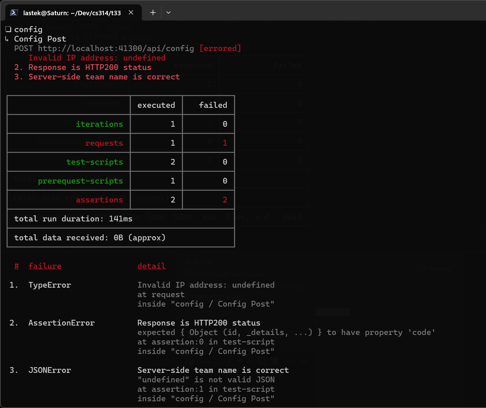
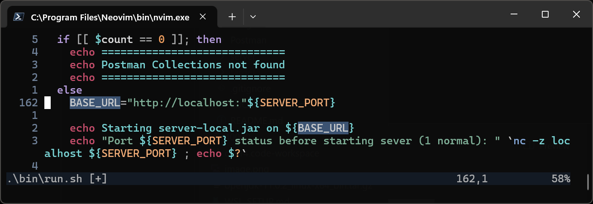
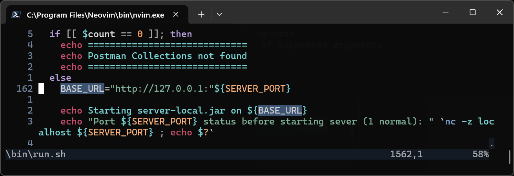
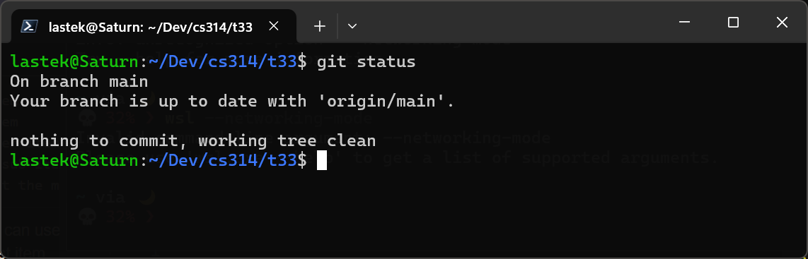
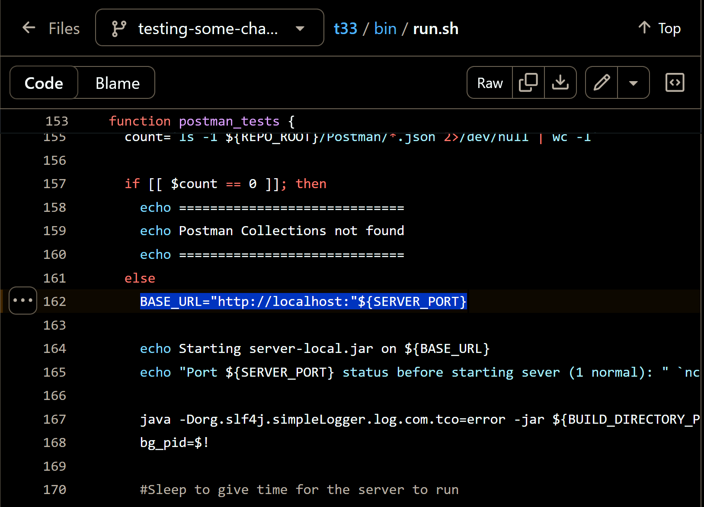

# WSL
There may be an issue with how WSL2 handles addressing but it's a simple fix.

**Assuming you've already gone through the steps outlined in `LOCAL-SETUP.md` inside the t33 directory.**

> This is what you might see.

## The Fix

We'll modify `run.sh` and hopefully that will fix it for you. \
For some reason WSL is not happy with the localhost addres.

Change this line (line 162):

To this:

> `BASE_URL="http://127.0.0.1:"${SERVER_PORT}`

Now save it and try running it again and it should be working.

## Some necessary changes to .git
We need to modify git to ignore the file so it doesnt get pushed by accident or overwritten.

> git update-index --assume-unchanged bin/run.sh

Check to make sure it worked. You should see this:

Now create a new branch to test this out

> git switch -c <some_name>
> git push --set-upstream origin <some_name>

Open it in github and make sure that line 162 is the same as it was before:

